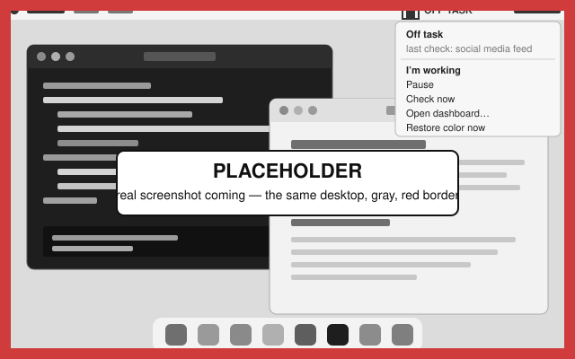

# Grayout for Mac

Your Mac goes gray until you get back to work.

Grayout is a menu-bar app. Every 45 seconds it takes a screenshot of each display and asks Claude (or GPT) one question: is this person clearly not working? Two yeses in a row and every display loses its color and gets a red border. Color comes back the moment you get back to work. It never blocks, closes, or locks anything.

<!-- Placeholder image. When the real capture lands as docs/img/hero-gray.png (see docs/img/README.md), change the path here too. -->


Site: https://aarushkandukoori.github.io/grayout/

## Download

- Apple Silicon: https://github.com/aarushkandukoori/grayout/releases/latest/download/Grayout-arm64.dmg
- Intel: https://github.com/aarushkandukoori/grayout/releases/latest/download/Grayout-x64.dmg

macOS 13 (Ventura) or later. Free and open source. Uses your own Anthropic or OpenAI API key. Not yet notarized, so the first launch takes three extra clicks (below).

Not sure which one you have: Apple menu > About This Mac. "Chip: Apple M…" means Apple Silicon.

To verify a download, compare it against `SHA256SUMS.txt` on the release page:

```bash
shasum -a 256 ~/Downloads/Grayout-arm64.dmg
```

## First launch on macOS

Grayout is a one-person open-source project and is not yet in Apple's notarization program, so macOS warns you once. The full walk-through with screenshots is at https://aarushkandukoori.github.io/grayout/install.html.

1. **Download and drag.** Open the DMG, drag Grayout onto the Applications folder, eject. It must be in Applications for the Open Anyway exception and Start at login to work.
2. **First launch.** Double-click Grayout in Applications. macOS shows: *Apple could not verify "Grayout" is free of malware that may harm your Mac or compromise your privacy.* with buttons **Done** and **Move to Trash**. Click **Done**. (Control-click > Open no longer bypasses this on macOS 15 and 26.)
3. **Allow it.** Open System Settings > Privacy & Security, scroll down to the Security section. You'll see *"Grayout" was blocked to protect your Mac.* Click **Open Anyway**, enter your password or use Touch ID, then click **Open Anyway** (or **Open**) in the dialog that follows. macOS remembers this. Some guides report the Open Anyway button disappears about an hour after the blocked attempt; if you don't see it, double-click Grayout again and come back.

Terminal alternative that skips the dialog:

```bash
xattr -dr com.apple.quarantine /Applications/Grayout.app
```

Why: removing this warning requires Apple's $99/year Developer Program and notarization. That is the first thing on the roadmap.

## Permissions

Grayout asks for two things and never asks for Accessibility, Automation, or Full Disk Access.

- **Screen Recording** (required). Onboarding step 2 opens System Settings > Privacy & Security > Screen Recording. Turn on Grayout, then click Relaunch Grayout. macOS applies this permission only after the app restarts. Grayout reopens at the next step.
- **Camera** (optional, off by default). Only if you turn on the webcam option. macOS asks the moment you flip the toggle.
- **Login item** (optional). Start at login uses the system login-item service and only works when Grayout is in /Applications. If macOS says it needs approval, the Permissions menu links to Login Items settings.
- **Keychain.** When you save your API key, macOS asks once whether Grayout may use its own Keychain item ("Grayout Safe Storage"). Click **Always Allow**.

After an update, macOS sometimes reports Screen Recording as allowed while captures come back blank. Turn Grayout off and on in the Screen Recording list, or reset the grant and grant it again (the tray's Permissions menu has a Copy the fix command item for this):

```bash
tccutil reset ScreenCapture com.aarushkandukoori.grayout
```

## Your API key and what it costs

The app is free. Grayout runs on your own Anthropic or OpenAI account, so you pay them directly and nothing goes through anyone else. Either key works; Grayout tells them apart (`sk-ant-` is Anthropic, `sk-proj-` or `sk-` is OpenAI) and calls that provider's API. Getting a key takes about two minutes: https://aarushkandukoori.github.io/grayout/api-key.html. New accounts at either need a $5 prepaid credit.

With an Anthropic key, each check costs about a quarter of a cent (about $0.0025 on Claude Haiku 4.5). With an OpenAI key, about a fifteenth of a cent (about $0.0007 on gpt-5-mini, measured 2026-09-21 at about 2,060 input and 80 output tokens per check). Estimates for one display, at list prices as of 2026-09-21:

| Setting | Interval | Anthropic, per working day | Anthropic, per month (22 days) | OpenAI, per working day | OpenAI, per month (22 days) |
|---|---|---|---|---|---|
| Strict | 30 s | about $1.35 | about $30 | about $0.38 | about $8 |
| Balanced (default) | 45 s | about $0.90 | about $20 | about $0.26 | about $6 |
| Light | 90 s | about $0.45 | about $10 | about $0.13 | about $3 |

The webcam adds about 15%. Each additional display roughly doubles the per-check cost. The theoretical ceiling is 8 hours nonstop at 30 seconds, 960 checks, about $2.60 a day with Anthropic or about $0.70 with OpenAI; the `dailyCheckCap` (1,200 checks) pauses checks for the rest of the day before you get there. The dashboard shows what you have spent today and a monthly projection at your current pace, computed locally from the token counts your provider returns with every check.

The key is stored encrypted in your macOS Keychain, is never written to config.json or the logs, and is shown in Settings only as its first seven characters plus its last four. A workspace with a monthly spend limit at console.anthropic.com, or a project with a monthly budget at platform.openai.com, is the simplest hard cap; the key guide shows how.

## How it works

1. Every 45 seconds (configurable) the loop checks its guards: paused, screen locked, idle for 10 minutes, daily cap reached, or inside the 10-minute grace after you clicked I'm working. Any of those, and nothing is captured.
2. It reads the frontmost app's name with `lsappinfo` (no permission needed). A password manager in front means no capture at all. A video-call app in front clears any alert and skips the check.
3. It captures every display (up to three) with `/usr/sbin/screencapture`, resizes each to 1366 px wide, encodes it as a JPEG, and deletes the file. Mirrored displays are deduplicated.
4. It sends the images, a fixed prompt, and optionally your one-line work description and task titles to the model (`claude-haiku-4-5` with an Anthropic key, `gpt-5-mini` with an OpenAI key), which answers with a three-field JSON verdict: `off_task`, `activity`, `confidence`.
5. A strike is counted only when `off_task` is exactly `true` with `high` confidence. Anything else, including an error, a refusal, or a malformed answer, resets the strike count to zero.
6. Two strikes in a row: a red border on every display and system-wide grayscale. The next on-task verdict, I'm working, Pause, Quit, or the 20-minute watchdog restores color.

The prompt is in [`src/analyzer.js`](src/analyzer.js). It tells the model that a video call or screen share is work, that anything ambiguous is work, and to name only the category of what it sees, never on-screen text.

## What leaves your Mac

Sent to `api.anthropic.com` or `api.openai.com`, whichever your key belongs to, under your key, at each check:

- A resized screenshot of each display.
- A webcam frame, only if you turned the camera on.
- Your one-line work description, if you wrote one.
- Titles of your Canvas to-do items or your task file's unchecked lines, if you configured either. They are fenced and labeled as untrusted data in the prompt.

Not sent anywhere: nothing goes to the author. There is no account, no server, and no analytics. Screenshot files are deleted from this Mac right after each check; webcam frames never touch the disk. The only other connection is an anonymous version check against `api.github.com` once a day, which you can turn off in Settings.

Stored on your Mac in `~/Library/Application Support/Grayout/`: your settings, the encrypted key, a 30-day log of short category phrases like "code editor and terminal" (one line per check, deletable from Settings), and a rotating app log that never contains prompt text, images, or your key.

The full policy is in [PRIVACY.md](PRIVACY.md).

## Escape hatches for a stuck gray screen

System-wide grayscale is a CoreGraphics flag that outlives the process, so Grayout has seven ways back to color:

1. Grayout turns grayscale off on every launch, before it does anything else. Relaunching the app restores color.
2. Color is restored on quit, on a crash, on SIGINT and SIGTERM, on an uncaught exception, and on system shutdown.
3. A watchdog restores color after 20 minutes of gray no matter what (`maxAlertMinutes`).
4. The menu-bar item **Restore color now** works in every state, including paused and blocked.
5. The helper binary can be run by hand:

   ```bash
   "/Applications/Grayout.app/Contents/Resources/helper/grayscale" off
   ```

6. Without a terminal: System Settings > Accessibility > Display > Color Filters. Turn it on, then off. This resets the same flag.
7. Onboarding's **Preview the gray** proves the restore path on your Mac before the loop is armed.

If none of these work, open an issue with the "My screen is stuck gray" template.

## Settings and advanced config

The common settings are in the dashboard (menu bar > Settings…). Everything lives in `~/Library/Application Support/Grayout/config.json`; hand edits are picked up within a couple of seconds, and Settings > Advanced opens the file in your editor. Values outside the ranges below are clamped; a file that does not parse is copied to `config.json.invalid` and defaults are used until you fix it.

| Key | Default | Range or type | What it does |
|---|---|---|---|
| `checkIntervalSec` | `45` | 10 to 3600 | Seconds between checks. Settings offers 30, 45, 60, 90, 120. |
| `strikes` | `2` | 1 to 20 | Consecutive high-confidence off-task verdicts before the screen reacts. |
| `idleSkipSec` | `600` | 30 to 86400 | After this long with no keyboard or mouse input, checks stop. An existing gray is held, not cleared. |
| `heldAlertRecheckSec` | `300` | 60 to 3600 | While idle and gray, still run one check this often so a wrong gray corrects itself. |
| `maxAlertMinutes` | `20` | 1 to 240 | Watchdog: color always comes back after this long. |
| `disputeGraceMin` | `10` | 1 to 120 | How long I'm working keeps the screen from going gray again. |
| `wakeGraceSec` | `45` | 0 to 600 | Wait after unlock or wake before the first check. |
| `dailyCheckCap` | `1200` | 50 to 20000 | Checks per local day. When reached, checks pause until tomorrow. |
| `camera` | `false` | boolean | Send a webcam frame with each check. |
| `grayscale` | `true` | boolean | Use system-wide grayscale as the consequence. Off means red border only. |
| `redFlash` | `true` | boolean | Red border on every display while off task. |
| `pauseWhenLocked` | `true` | boolean | No checks while the screen is locked or the Mac is asleep. |
| `alwaysAllowedApps` | `["zoom.us", "FaceTime", "Microsoft Teams", "Webex", "Google Meet", "Discord"]` | list of strings | Frontmost app names that never trigger and clear an alert. Case-insensitive substring match. |
| `neverCaptureApps` | `["1Password", "Bitwarden", "Passwords", "Keychain Access"]` | list of strings | Frontmost app names that are never captured. Applies to the frontmost app only; other windows may still be visible in a capture. |
| `workDescription` | `""` | up to 500 characters | One line telling the model what your work looks like. |
| `logVerdicts` | `true` | boolean | Append each verdict to `verdicts.jsonl`. Off means an empty dashboard. |
| `startAtLogin` | `false` | boolean | Register a login item (only when in /Applications). |
| `checkForUpdates` | `true` | boolean | Anonymous daily version check against api.github.com. |
| `historyDays` | `30` | 1 to 365 | `verdicts.jsonl` is pruned to this many days at launch and once a day. |

Advanced keys with no UI, edited in `config.json` directly:

| Key | Default | Range or type | What it does |
|---|---|---|---|
| `provider` | `"auto"` | `auto`, `anthropic`, or `openai` | Which API to call. `auto` reads it from the key: `sk-ant-` is Anthropic, `sk-proj-` or `sk-` is OpenAI. |
| `model` | `"claude-haiku-4-5"` | any `claude-*` or `gpt-*` model your key can use | Model used for checks. If it does not belong to the active provider's family, the provider default applies: `claude-haiku-4-5` for Anthropic, `gpt-5-mini` for OpenAI. The cost meter knows prices for the models listed in `src/pricing.js`; anything else shows "n/a". |
| `canvas.baseUrl` | `"https://canvas.cmu.edu"` | https URL | Your Canvas LMS host. |
| `canvas.token` | `""` | string | A Canvas API token. Paste it here once; on the next load Grayout moves it into the Keychain and blanks this field. Titles of your to-do and planner items (up to 20) are then sent with each check as fenced, untrusted context, refreshed every 10 minutes. |
| `tasksFile` | `""` | absolute path | A Markdown file. Its unchecked lines (`- [ ] task`, up to 20) are sent with each check as fenced, untrusted context. |
| `engine` | `"api"` | | Leave as `api`. |
| `schemaVersion` | `1` | | Leave as `1`. |

Data folder layout: `config.json`, `secrets.bin` (Keychain-encrypted), `state.json`, `verdicts.jsonl`, `logs/grayout.log`. Settings > Reveal data folder opens it. Delete all history truncates `verdicts.jsonl` and nothing else.

## Build from source

Needs Node 22 and the Xcode Command Line Tools (for `clang`, which builds the 50 KB grayscale helper).

```bash
git clone https://github.com/aarushkandukoori/grayout && cd grayout && npm ci && npm run helper && npm start
```

Running from source uses the same data folder as the packaged app. A developer running from source may set `ANTHROPIC_API_KEY` or `OPENAI_API_KEY` in the environment instead of saving a key; the packaged app ignores both.

Other scripts:

```bash
npm test          # node --test 'tests/**/*.test.js' (plain Node, no Electron)
npm run check     # node --check on every JS file
npm run dist      # helper + Grayout-arm64.dmg and Grayout-x64.dmg in dist/
npm run verify:dmg dist/Grayout-arm64.dmg
npm run smoke:api # one real check against a synthetic frame; needs ANTHROPIC_API_KEY
```

## Updating

Download the new DMG, drag it over the old app, relaunch. The tray shows "Update available" when a newer release exists. macOS may ask for Screen Recording again after an update; if the toggle is on but captures are blank, use Permissions > Copy the fix command.

## Uninstall

Turn off Start at login in Settings, quit Grayout, drag it to the Trash, and delete `~/Library/Application Support/Grayout`. Revoke the key at console.anthropic.com or platform.openai.com if you will not use it again.

## Contributing

See [CONTRIBUTING.md](CONTRIBUTING.md). Bugs go to Issues using one of the three templates; questions go to Discussions. A hosted version that needs no API key is being considered; reply to the pinned Discussions thread to be notified. There is no hosted price yet and none is promised.

## Not for employers

Grayout reports to nobody but you. There is no team dashboard and there never will be an employer edition. If a workplace installs this on your machine, that is not what it is for.

## Security

See [SECURITY.md](SECURITY.md) for how to report a vulnerability and for the threat model.

## License

MIT. Copyright (c) 2026 Aarush Kandukoori. See [LICENSE](LICENSE).
