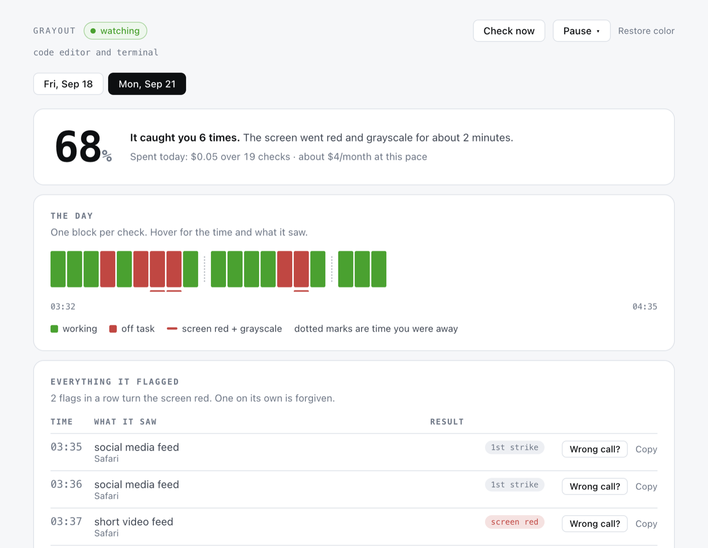

# Grayout for Mac

Your Mac goes gray until you get back to work.

Grayout is a menu-bar app. Every 45 seconds it looks at your screen and asks one question: is this person clearly not working? Two yeses in a row and every display loses its color and gets a red border. Color comes back the moment you get back to work. It never blocks, closes, or locks anything.

**$9.99 a month, or $79 a year. 100 checks free first, no card.** The app is the whole product; there is nothing to configure and no API key to get.



*The dashboard, on a day with a few flags.*

Site: https://aarushkandukoori.github.io/grayout/

## Download

- Apple Silicon: https://github.com/aarushkandukoori/grayout/releases/latest/download/Grayout-arm64.dmg
- Intel: https://github.com/aarushkandukoori/grayout/releases/latest/download/Grayout-x64.dmg

macOS 13 (Ventura) or later. Not yet notarized, so the first launch takes three extra clicks (below).

Not sure which one you have: Apple menu > About This Mac. "Chip: Apple M…" means Apple Silicon.

Or with Homebrew:

```bash
brew install --cask aarushkandukoori/tap/grayout
```

To verify a download, compare it against `SHA256SUMS.txt` on the release page:

```bash
shasum -a 256 ~/Downloads/Grayout-arm64.dmg
```

## First launch on macOS

Grayout is a one-person project and is not yet in Apple's notarization program, so macOS warns you once. The full walk-through with screenshots is at https://aarushkandukoori.github.io/grayout/install.html.

1. **Download and drag.** Open the DMG, drag Grayout onto the Applications folder, eject. It must be in Applications for the Open Anyway exception and Start at login to work.
2. **First launch.** Double-click Grayout in Applications. macOS shows: *Apple could not verify "Grayout" is free of malware that may harm your Mac or compromise your privacy.* with buttons **Done** and **Move to Trash**. Click **Done**. (Control-click > Open no longer bypasses this on macOS 15 and 26.)
3. **Allow it.** Open System Settings > Privacy & Security, scroll down to the Security section. You'll see *"Grayout" was blocked to protect your Mac.* Click **Open Anyway**, enter your password or use Touch ID, then click **Open Anyway** (or **Open**) in the dialog that follows. macOS remembers this. Some guides report the Open Anyway button disappears about an hour after the blocked attempt; if you don't see it, double-click Grayout again and come back.
4. **Turn on Screen Recording, then start.** Onboarding walks you through the permission and a relaunch, shows you the gray once so you know what it looks like, and starts watching. There is no key to paste and no account to create: your first 100 checks run immediately.

Terminal alternative that skips the Gatekeeper dialog:

```bash
xattr -dr com.apple.quarantine /Applications/Grayout.app
```

Why: removing this warning requires Apple's $99/year Developer Program and notarization. That is the first thing on the roadmap.

## What it costs

| Plan | Price | What you get |
|---|---|---|
| Free taste | $0, no card, no account | 100 checks, about one working day |
| Pro monthly | $9.99 a month, 7-day free trial | 15,000 checks a month |
| Pro yearly | $79 a year (34% off) | 15,000 checks a month |

**Free taste.** The first 100 checks need nothing from you: no card, no email, no sign-in. They are tied to this install, so they are a taste of the product, not a free tier. A check is spent only when you are at the Mac and something on screen actually changed, so 100 of them usually stretch across most of a working day: long enough to see it gray you out, and long enough to see it leave you alone while you work.

**Trial.** Monthly carries a 7-day free trial. You enter a card, you are not charged until day 8, and cancelling inside the week costs nothing.

**Subscribing.** Click Subscribe in the menu bar. Grayout opens Stripe's checkout page in your browser; when you finish paying, the app unlocks itself within a few seconds. There is nothing to copy and no password to invent. If you already have a license key (a second Mac, a reinstall), paste it in Settings instead.

**The allowance.** 15,000 checks a month is well above ordinary use. A full month of watched work at the default interval is around 8,000 checks, and change-gating (below) removes roughly half of those. If you somehow pass 15,000, the service stretches the interval rather than cutting you off: Grayout keeps working, more slowly, until the period rolls over.

**Managing or cancelling.** Settings > Manage subscription opens Stripe's billing portal, where you can change the card, switch plans, or cancel. Cancelling leaves the app installed and watching until the period you paid for ends.

**Change-gating** is why $9.99 works. Before spending a check, Grayout compares a small hash of each display against the previous one. If nothing on any display changed and the frontmost app is the same and no alert is running, it skips the call and keeps the last verdict. A real check runs at least every `forceCheckSec` (180 seconds by default) regardless, so a screen that is deliberately held still is still caught. Set `changeGating` to `false` if you would rather pay for every interval.

## Permissions

Grayout asks for two things and never asks for Accessibility, Automation, or Full Disk Access.

- **Screen Recording** (required). Onboarding step 2 opens System Settings > Privacy & Security > Screen Recording. Turn on Grayout, then click Relaunch Grayout. macOS applies this permission only after the app restarts. Grayout reopens at the next step.
- **Camera** (optional, off by default). Only if you turn on the webcam option. macOS asks the moment you flip the toggle.
- **Login item** (optional). Start at login uses the system login-item service and only works when Grayout is in /Applications. If macOS says it needs approval, the Permissions menu links to Login Items settings.
- **Keychain.** When Grayout saves your license key, macOS asks once whether it may use its own Keychain item ("Grayout Safe Storage"). Click **Always Allow**.

After an update, macOS sometimes reports Screen Recording as allowed while captures come back blank. Turn Grayout off and on in the Screen Recording list, or reset the grant and grant it again (the tray's Permissions menu has a Copy the fix command item for this):

```bash
tccutil reset ScreenCapture com.aarushkandukoori.grayout
```

## How it works

1. Every 45 seconds (configurable) the loop checks its guards: paused, screen locked, idle for 10 minutes, daily cap reached, or inside the 10-minute grace after you clicked I'm working. Any of those, and nothing is captured.
2. It reads the frontmost app's name with `lsappinfo` (no permission needed). A password manager in front means no capture at all. A video-call app in front clears any alert and skips the check.
3. It captures every display (up to three) with `/usr/sbin/screencapture`, resizes each to 1366 px wide, encodes it as a JPEG, and deletes the file. Mirrored displays are deduplicated.
4. Change-gating compares each display against the previous check. Nothing changed, same frontmost app, no alert running: the call is skipped and the previous verdict stands, until `forceCheckSec` forces a real one.
5. It sends the images, and optionally your one-line work description and task titles, to the Grayout service, which asks a vision model and returns a three-field verdict: `off_task`, `activity`, `confidence`. The prompt lives on the service, so judgement improves without you installing anything.
6. A strike is counted only when `off_task` is exactly `true` with `high` confidence. Anything else, including an error, a refusal, an expired subscription, or a malformed answer, resets the strike count to zero. Grayout fails toward leaving you alone.
7. Two strikes in a row: a red border on every display and system-wide grayscale. The next on-task verdict, I'm working, Pause, Quit, or the 20-minute watchdog restores color.

The prompt tells the model that a video call or screen share is work, that anything ambiguous is work, and to name only the category of what it sees, never on-screen text. The self-hosted prompt, which is the same shape, is in [`src/analyzer.js`](src/analyzer.js).

## What leaves your Mac

Sent to `api.grayout.app`, under your license key, at each check that is not skipped:

- A resized screenshot of each display.
- A webcam frame, only if you turned the camera on.
- Your one-line work description, if you wrote one.
- Titles of your Canvas to-do items or your task file's unchecked lines, if you configured either. They are fenced and labeled as untrusted data in the prompt.
- Your device id and license key, so the service knows the request is paid for.

The service forwards the images to OpenAI, gets the verdict, and returns it. It does not store the images and does not log them. What it keeps is your license record, your device id, and a count of checks this month.

The only other connections are an anonymous version check against `api.github.com` once a day, which you can turn off in Settings, and your Canvas host if you configured one. Stripe handles payment on its own pages in your browser; Grayout never sees your card.

Stored on your Mac in `~/Library/Application Support/Grayout/`: your settings, the encrypted license key, a 30-day log of short category phrases like "code editor and terminal" (one line per check, deletable from Settings), and a rotating app log that never contains prompt text, images, or your key.

The full policy is in [PRIVACY.md](PRIVACY.md). If you would rather send nothing to us at all, see Self-hosting.

## Escape hatches for a stuck gray screen

System-wide grayscale is a CoreGraphics flag that outlives the process, so Grayout has seven ways back to color:

1. Grayout turns grayscale off on every launch, before it does anything else. Relaunching the app restores color.
2. Color is restored on quit, on a crash, on SIGINT and SIGTERM, on an uncaught exception, and on system shutdown.
3. A watchdog restores color after 20 minutes of gray no matter what (`maxAlertMinutes`).
4. The menu-bar item **Restore color now** works in every state, including paused, blocked, and unsubscribed.
5. The helper binary can be run by hand:

   ```bash
   "/Applications/Grayout.app/Contents/Resources/helper/grayscale" off
   ```

6. Without a terminal: System Settings > Accessibility > Display > **Color Filters**, and turn it off. That is the exact switch Grayout uses, so this always works.
7. Onboarding's **Preview the gray** proves the restore path on your Mac before the loop is armed.

Nothing to do with billing can leave your screen gray. A license that lapses, a failed payment, an exhausted free taste, or an unreachable service all stop checks; they never start an alert.

If none of these work, open an issue with the "My screen is stuck gray" template.

## Self-hosting

**Grayout is MIT-licensed and the whole app is in this repository.** If you would rather not pay a subscription, or would rather no screenshot ever passed through a machine of ours, you can run it against your own Anthropic or OpenAI key. This is a build-from-source path, it is not what the packaged app is set up for, and it gets no support beyond the repository. It is not going away.

Set `provider` in `~/Library/Application Support/Grayout/config.json` to the provider whose key you hold. That disables the Grayout service entirely: no license check, no call to `api.grayout.app`, no subscription, and the app calls the provider directly under your key.

```jsonc
{
  "provider": "openai",          // or "anthropic"; "grayout" forces the subscription
  "model": "gpt-5-mini",         // or "claude-haiku-4-5" with an Anthropic key
  "changeGating": true,          // keeps your own bill down too
  "forceCheckSec": 180
}
```

The default, `"auto"`, does this on its own: a Mac with a model key saved self-hosts on that key's provider, and a Mac without one uses the subscription. Setting `provider` explicitly is how you stop that from depending on what happens to be in your Keychain.

Then run it from source with the key in the environment:

```bash
git clone https://github.com/aarushkandukoori/grayout && cd grayout && npm ci && npm run helper
OPENAI_API_KEY=sk-... npm start       # or ANTHROPIC_API_KEY=sk-ant-...
```

Costs you pay directly to the provider, at list prices as of 2026-09-22, for one display with change-gating on:

| Provider and model | Per check | A month of watched work (about 4,000 checks) |
|---|---|---|
| OpenAI, `gpt-5-mini` | about $0.0007 | about $3 |
| Anthropic, `claude-haiku-4-5` | about $0.0025 | about $10 |

The webcam adds about 15%. Each additional display roughly doubles the per-check cost. `dailyCheckCap` (1,200 checks) is the hard stop. A workspace spend limit at console.anthropic.com, or a project budget at platform.openai.com, is the simplest real cap.

You can also run the service yourself: `server/` is the Cloudflare Worker, and `apiBase` points the app at your own deployment. Endpoints and payloads are in [docs/API-CONTRACT.md](docs/API-CONTRACT.md).

## Settings and advanced config

The common settings are in the dashboard (menu bar > Settings…). Everything lives in `~/Library/Application Support/Grayout/config.json`; hand edits are picked up within a couple of seconds, and Settings > Advanced opens the file in your editor. Values outside the ranges below are clamped; a file that does not parse is copied to `config.json.invalid` and defaults are used until you fix it.

| Key | Default | Range or type | What it does |
|---|---|---|---|
| `checkIntervalSec` | `45` | 10 to 3600 | Seconds between checks. Settings offers 30, 45, 60, 90, 120. |
| `strikes` | `2` | 1 to 20 | Consecutive high-confidence off-task verdicts before the screen reacts. |
| `changeGating` | `true` | boolean | Skip the check when no display changed and the frontmost app is the same. Off means every interval spends a check. |
| `forceCheckSec` | `180` | 30 to 3600 | Run a real check at least this often even when nothing changed. |
| `idleSkipSec` | `600` | 30 to 86400 | After this long with no keyboard or mouse input, checks stop. An existing gray is held, not cleared. |
| `heldAlertRecheckSec` | `300` | 60 to 3600 | While idle and gray, still run one check this often so a wrong gray corrects itself. |
| `maxAlertMinutes` | `20` | 1 to 240 | Watchdog: color always comes back after this long. |
| `disputeGraceMin` | `10` | 1 to 120 | How long I'm working keeps the screen from going gray again. |
| `wakeGraceSec` | `45` | 0 to 600 | Wait after unlock or wake before the first check. |
| `dailyCheckCap` | `1200` | 50 to 20000 | Checks per local day. When reached, checks pause until tomorrow. |
| `camera` | `false` | boolean | Send a webcam frame with each check. |
| `grayscale` | `true` | boolean | Use system-wide grayscale as the consequence. Off means red border only. |
| `redFlash` | `true` | boolean | Red border on every display while off task. |
| `pauseWhenLocked` | `true` | boolean | No checks while the screen is locked or the Mac is asleep. |
| `alwaysAllowedApps` | `["zoom.us", "FaceTime", "Microsoft Teams", "Webex", "Google Meet", "Discord"]` | list of strings | Frontmost app names that never trigger and clear an alert. Case-insensitive substring match. |
| `neverCaptureApps` | `["1Password", "Bitwarden", "Passwords", "Keychain Access"]` | list of strings | Frontmost app names that are never captured. Applies to the frontmost app only; other windows may still be visible in a capture. |
| `workDescription` | `""` | up to 500 characters | One line telling the model what your work looks like. |
| `logVerdicts` | `true` | boolean | Append each verdict to `verdicts.jsonl`. Off means an empty dashboard. |
| `startAtLogin` | `false` | boolean | Register a login item (only when in /Applications). |
| `checkForUpdates` | `true` | boolean | Anonymous daily version check against api.github.com. |
| `historyDays` | `30` | 1 to 365 | `verdicts.jsonl` is pruned to this many days at launch and once a day. |

Advanced keys with no UI, edited in `config.json` directly:

| Key | Default | Range or type | What it does |
|---|---|---|---|
| `provider` | `"auto"` | `auto`, `grayout`, `anthropic`, or `openai` | Where checks go. `auto` means the subscription, unless a model key is saved on this Mac, in which case it self-hosts on that key's provider. `grayout` forces the subscription and ignores any saved key. `anthropic` and `openai` force self-hosting on that provider. |
| `apiBase` | `""` | https URL, or empty | The Grayout service to talk to. Empty means `https://api.grayout.app`. Only https is accepted, except `http://localhost`, and anything else is ignored rather than used. Change it only to point at a deployment of `server/` that you run. |
| `model` | `"claude-haiku-4-5"` | any `claude-*` or `gpt-*` model your key can use | Self-hosting only. If it does not belong to the active provider's family, the provider default applies: `claude-haiku-4-5` for Anthropic, `gpt-5-mini` for OpenAI. On the subscription the service picks the model. |
| `canvas.baseUrl` | `"https://canvas.cmu.edu"` | https URL | Your Canvas LMS host. |
| `canvas.token` | `""` | string | A Canvas API token. Paste it here once; on the next load Grayout moves it into the Keychain and blanks this field. Titles of your to-do and planner items (up to 20) are then sent with each check as fenced, untrusted context, refreshed every 10 minutes. |
| `tasksFile` | `""` | absolute path | A Markdown file. Its unchecked lines (`- [ ] task`, up to 20) are sent with each check as fenced, untrusted context. |
| `engine` | `"api"` | | Leave as `api`. |
| `schemaVersion` | `1` | | Leave as `1`. |

Data folder layout: `config.json`, `secrets.bin` (Keychain-encrypted, holds the license key), `state.json` (includes your device id), `verdicts.jsonl`, `logs/grayout.log`. Settings > Reveal data folder opens it. Delete all history truncates `verdicts.jsonl` and nothing else.

## Build from source

Needs Node 22 and the Xcode Command Line Tools (for `clang`, which builds the 50 KB grayscale helper).

```bash
git clone https://github.com/aarushkandukoori/grayout && cd grayout && npm ci && npm run helper && npm start
```

Running from source uses the same data folder as the packaged app. Point it somewhere else with `GRAYOUT_USER_DATA` if you would rather not touch your real settings. Unpackaged, `GRAYOUT_API_BASE` overrides `apiBase`, and `ANTHROPIC_API_KEY` or `OPENAI_API_KEY` supply a self-hosting key; the packaged app ignores all three.

Other scripts:

```bash
npm test          # node --test 'tests/**/*.test.js' (plain Node, no Electron)
npm run check     # node --check on every JS file
npm run dist      # helper + Grayout-arm64.dmg and Grayout-x64.dmg in dist/
npm run verify:dmg dist/Grayout-arm64.dmg
npm run smoke:api # one real check against a synthetic frame
```

The service is a separate package in `server/`: `npm --prefix server test`, `npm --prefix server run dev` (wrangler), `npm --prefix server run deploy`.

## Updating

Download the new DMG, drag it over the old app, relaunch. Your license and your settings survive. Coming from 1.x with an API key already saved: that key is still there and still used, because `provider` defaults to `auto`. Set `provider` to `grayout` to move onto the subscription, or leave it alone to keep paying your provider directly. The tray shows "Update available" when a newer release exists. macOS may ask for Screen Recording again after an update; if the toggle is on but captures are blank, use Permissions > Copy the fix command.

## Uninstall

Cancel the subscription first, in Settings > Manage subscription, or later at any time through the link in your Stripe receipt. Then turn off Start at login, quit Grayout, drag it to the Trash, and delete `~/Library/Application Support/Grayout`. Deleting the app does not cancel anything on its own.

## Contributing

See [CONTRIBUTING.md](CONTRIBUTING.md). Bugs go to Issues using the templates; questions go to Discussions. Billing problems have their own template, and the rule there is simple: never paste a license key or a card number into a public issue.

## Not for employers

Grayout reports to nobody but you. There is no team dashboard, no admin console, and there never will be an employer edition. The service knows your license and a count of checks; it does not know what you were doing. If a workplace installs this on your machine, that is not what it is for.

## Security

See [SECURITY.md](SECURITY.md) for how to report a vulnerability and for the threat model, which now covers the service as well as the app.

## License

MIT. Copyright (c) 2026 Aarush Kandukoori. See [LICENSE](LICENSE).
